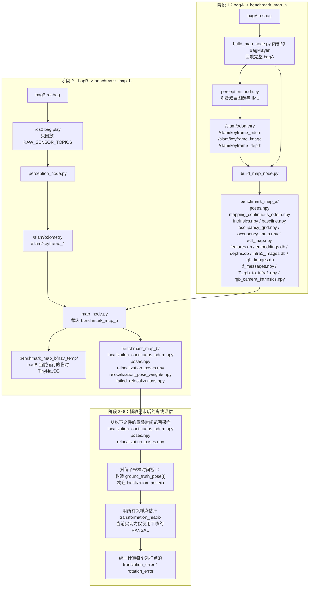

# Benchmark Mapping 流程说明

本文档说明 `tool/benchmark/benchmark_mapping.py` 的当前运行流程、目录产物来源，以及最后离线误差计算时各类文件分别代表什么。

本文档以当前代码实现为准，主要对应以下文件：

- `tool/benchmark/benchmark_mapping.py`
- `tinynav/core/perception_node.py`
- `tinynav/core/build_map_node.py`
- `tinynav/core/map_node.py`

如果本文档和旧说明不一致，以当前代码为准。

## 总体流程



## 输出目录概览

- `benchmark_map_a/`
  - 由 `bagA` 建出的参考地图目录
  - 在 `bagB` 的定位阶段被 `map_node.py` 载入

- `benchmark_map_b/`
  - `bagB` 回放过程中生成的结果目录
  - 同时包含两类信息：
    - bagB 自己的局部参考轨迹
    - bagB 在 mapA 中重定位得到的轨迹

## 阶段 1：bagA 如何生成 `benchmark_map_a`

### bagA 的回放方式

在建图阶段，不是外部运行 `ros2 bag play`，而是 `build_map_node.py` 自己内部创建 `BagPlayer`，并回放完整的 `bagA`。

这和 `bagB` 的定位阶段不同。定位阶段是 `benchmark_mapping.py` 在外部启动 `ros2 bag play`。

### bagA 用到的原始输入

`perception_node.py` 使用来自 `bagA` 的原始传感器流：

- `/camera/camera/imu`
- `/camera/camera/infra1/image_rect_raw`
- `/camera/camera/infra2/image_rect_raw`
- `/camera/camera/infra2/camera_info`

`build_map_node.py` 除了消费 `/slam/*` 结果外，还会额外使用：

- `/camera/camera/infra2/camera_info`
- `/tf`
- `/tf_static`
- `/camera/camera/color/image_raw`，如果 bagA 有 RGB
- `/camera/camera/color/camera_info`，如果 bagA 有 RGB

### `benchmark_map_a` 中各文件的含义与来源

| 文件 | 含义 | 主要来源 |
|---|---|---|
| `features.db` | bagA 每个 keyframe 的 SuperPoint 特征 | `/slam/keyframe_image` |
| `embeddings.db` | bagA 每个 keyframe 的 DINO embedding | `/slam/keyframe_image` |
| `depths.db` | bagA 每个 keyframe 的深度图 | `/slam/keyframe_depth` |
| `infra1_images.db` | bagA 每个 keyframe 的灰度左目图 | `/slam/keyframe_image` |
| `rgb_images.db` | bagA 每个 keyframe 对应的 RGB 图像，如果存在 | `/camera/camera/color/image_raw` |
| `poses.npy` | bagA 的 keyframe 位姿，已经融合了 bagA 自己的回环与 pose graph 优化 | `/slam/keyframe_odom` 加 bagA 自己的回环约束 |
| `mapping_continuous_odom.npy` | bagA 回放过程中的连续 odom 轨迹 | `/slam/odometry` |
| `intrinsics.npy` | mapA 使用的红外相机内参 | `/camera/camera/infra2/camera_info` |
| `baseline.npy` | 双目基线 | `/camera/camera/infra2/camera_info` |
| `occupancy_grid.npy` | 根据 bagA 的 keyframe 位姿与深度生成的 3D 占据栅格 | `poses.npy` 与 `depths.db` |
| `occupancy_meta.npy` | 占据栅格原点与分辨率 | 与 `occupancy_grid.npy` 同时生成 |
| `sdf_map.npy` | 当前实现中的轨迹距离场 | `poses.npy` |
| `occupancy_2d_image.png` | 占据栅格的 2D 可视化 | `occupancy_grid.npy` |
| `tf_messages.npy` | 保存下来的 TF 信息 | `/tf` 与 `/tf_static` |
| `T_rgb_to_infra1.npy` | RGB 到 infra1 的外参 | `/tf` 与 `/tf_static` |
| `rgb_camera_intrinsics.npy` | RGB 相机内参 | `/camera/camera/color/camera_info` |

补充说明：

- 这些 `*.db` 文件底层是 `TinyNavDB`，按 keyframe 时间戳索引。
- 这里的 `poses.npy` 属于 `bagA`，不是 `bagB`。

## 阶段 2：bagB 回放时，`nav_temp/` 和 `benchmark_map_b/` 是什么

### bagB 的回放方式

在定位阶段，`benchmark_mapping.py` 会启动：

- `perception_node.py`
- `map_node.py`
- `ros2 bag play <bagB> --topics <RAW_SENSOR_TOPICS>`

这里只回放原始传感器话题，避免和录包中已有的 `/slam/*`、`/mapping/*` 输出冲突。

### bagB 回放时使用的 RAW_SENSOR_TOPICS

- `/camera/camera/imu`
- `/camera/camera/infra1/image_rect_raw`
- `/camera/camera/infra1/camera_info`
- `/camera/camera/infra2/image_rect_raw`
- `/camera/camera/infra2/camera_info`
- `/tf`
- `/tf_static`

### `benchmark_map_b/nav_temp/` 是什么

`nav_temp/` 不是 bagB 原始 topic 的原样落盘。

它是 `map_node.py` 在当前 bagB 定位运行期间创建的一个临时 `TinyNavDB`，用于保存 bagB 当前运行过程中生成出来的 keyframe 派生数据：

- bagB 当前 keyframe 的深度图
- bagB 当前 keyframe 的灰度图
- bagB 当前 keyframe 的 DINO embedding
- bagB 当前 keyframe 的 SuperPoint 特征
- 一个 3 通道的灰度占位图，用来适配 DB 的 RGB 字段结构

所以 `nav_temp/` 的本质是：

- 来源于 bagB 回放时，`perception_node.py` 在线生成的 keyframe
- 被 `map_node.py` 用于 bagB 自己的回环检测和 bagB 本地 pose graph 维护
- 不是 bagB rosbag 原始话题的备份目录

### bagB 回放时，`map_node.py` 同时做的两件事

对 bagB 的每个 keyframe，`map_node.py` 会同时执行两条逻辑：

1. bagB 自己的本地 keyframe 建图
   - 把当前 bagB keyframe 写入 `nav_temp`
   - 添加相邻 keyframe 间的 odom 约束
   - 在 bagB 自己已出现过的 keyframe 里做回环检测
   - 更新 `self.pose_graph_used_pose`

2. bagB 到 mapA 的重定位
   - 把当前 bagB keyframe 的 embedding 与 `benchmark_map_a` 中的 embedding 做检索
   - 把当前 bagB keyframe 特征与 mapA 候选 keyframe 特征做匹配
   - 使用 mapA keyframe 的深度和 PnP，估计当前 bagB 相机在 mapA 坐标系中的位姿
   - 成功时写入 `self.relocalization_poses`

这意味着：

- bagB 自己的回环是在线做的
- bagB 在 mapA 中的重定位也是在线做的

### `benchmark_map_b/` 中各文件的含义与来源

| 文件 | 含义 | 来源 |
|---|---|---|
| `localization_continuous_odom.npy` | bagB 在这次定位运行过程中的连续 odom 轨迹 | `perception_node.py` 发布的 `/slam/odometry` |
| `poses.npy` | bagB 自己的本地 keyframe pose graph 结果 | bagB keyframe 与 bagB 自己的 odom/回环约束 |
| `relocalization_poses.npy` | bagB 成功重定位时，相机在 mapA 坐标系中的位姿 | bagB 当前 keyframe 与 `benchmark_map_a` 的匹配结果 |
| `relocalization_pose_weights.npy` | 每次重定位的权重，当前实现相当于 PnP 内点比例 | relocalization 的 PnP 结果 |
| `failed_relocalizations.npy` | 哪些时间戳的重定位失败了 | bagB 到 mapA 的失败重定位记录 |
| `nav_temp/` | bagB 当前运行的临时 keyframe 数据库 | bagB keyframe 派生数据 |

要特别区分：

- `benchmark_map_b/poses.npy` 是 bagB 自己的本地参考轨迹
- `benchmark_map_b/relocalization_poses.npy` 是 bagB 在 mapA 中重定位得到的轨迹

## 阶段 3~6：播放结束后如何离线计算误差

`translation_error` 与 `rotation_error` 不是在 bagB 播放过程中实时计算的。

当前实现是在 bagB 播放结束、`benchmark_map_b/` 保存完成之后，再统一进入离线评估阶段：

1. 从以下三个文件的重叠时间范围中均匀采样时间戳
   - `localization_continuous_odom.npy`
   - `poses.npy`
   - `relocalization_poses.npy`
2. 对每个采样时间戳 `t`，分别构造两个 pose
3. 用所有采样点先估计一个全局刚体对齐 `transformation_matrix`
4. 再统一计算每个采样点的 `translation_error` 与 `rotation_error`

### 每个采样时间戳 `t` 比较的是哪两个 pose

严格说，最后不是“两个 index 相同的原始 keyframe”直接相减。

对于每个采样时间戳 `t`，benchmark 会先各自找两个锚点时间戳：

- `closest_keyframe_ts`
  - `benchmark_map_b/poses.npy` 中离 `t` 最近的时间戳
- `closest_reloc_ts`
  - `benchmark_map_b/relocalization_poses.npy` 中离 `t` 最近的时间戳

然后再用 `localization_continuous_odom.npy` 把这两个锚点 pose 都推进到同一个采样时间戳 `t`。

公式如下：

```text
ground_truth_pose(t)
= closest_keyframe_pose
   @ inv(odom_at_closest_keyframe_ts)
   @ odom_at_t

localization_pose(t)
= closest_reloc_pose
   @ inv(odom_at_closest_reloc_ts)
   @ odom_at_t
```

因此，最终比较的其实是：

- bagB 在采样时刻 `t` 的本地参考 pose
- bagB 在采样时刻 `t` 的 mapA 重定位 pose

而不是：

- “两个编号相同的原始 keyframe”

### 真正计算误差前还做了什么

在逐点计算误差之前，benchmark 还会先估计一个全局刚体对齐：

```text
transformation_matrix: localization 坐标系 -> reference 坐标系
```

当前实现中，这一步是基于所有采样点的平移做 RANSAC 估计。

然后对每个采样时间戳 `t`，比较的是：

```text
transformation_matrix @ localization_pose(t)
vs
ground_truth_pose(t)
```

最后由这两个 pose 计算出：

- `translation_error`
- `rotation_error`

## bagA 的 map 在整个流程里到底起什么作用

bagA 的 map 只参与重定位这条支路。

它向 `map_node.py` 提供：

- mapA 的 keyframe 位姿：`benchmark_map_a/poses.npy`
- mapA 的 depth/image/feature/embedding 数据库
- mapA 的内参
- mapA 的 occupancy 与 SDF 地图

在 bagB 回放时，bagA map 只负责回答一个问题：

- “当前 bagB keyframe 在 mapA 坐标系里位于哪里？”

bagA 的 map 不参与生成：

- `benchmark_map_b/poses.npy`
- `benchmark_map_b/localization_continuous_odom.npy`

这两个文件都来自 bagB 自己在当前定位运行中的数据流。

## 最后的准确表述

下面这段话是准确的：

- benchmark 里的 `groundTruth` 不是外部绝对真值，也不是 bagB 原始 topic 直接给出的绝对位姿
- 它其实是 bagB 自己的数据，在当前运行中构造出来的一条本地参考轨迹
- `localization` 则是 bagB 的数据在 mapA 中做重定位后得到的轨迹
- 最后 benchmark 会先把两条轨迹对齐，再比较它们

所以你可以这样理解：

> 用来做参考的轨迹，来自 bagB 自己的数据，与 bagA 的 map 重定位结果无关。  
> 用来与参考轨迹对比的 localization 轨迹，则来自 bagB 数据在 bagA 地图中的重定位结果。

但更准确的术语建议写成：

- `reference trajectory` 或 `self-consistency reference`

而不是：

- `absolute ground truth`

因为这个 benchmark 并没有使用外部绝对真值来源，例如：

- 动捕
- RTK
- 仿真器真值状态
